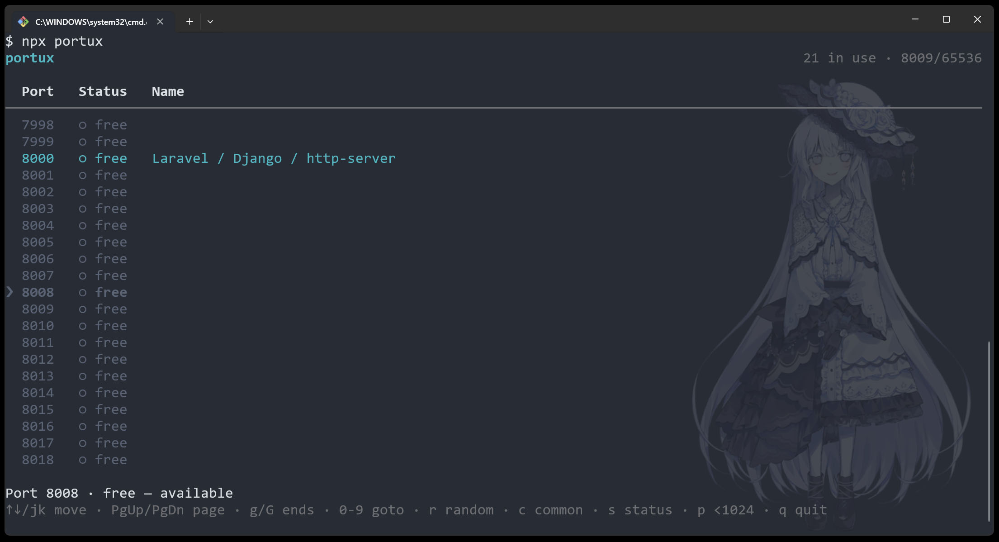

<h1 align="center">⚓ portux</h1>
<p align="center"><sup>(/ˈpɔːr.tʌks/, from Latin <em>Portus</em> — <em>harbor</em>)</sup></p>
<p align="center">A TUI dashboard to browse ports and pick a free one with ease</p>

<pre align="center">npx <b>portux</b></pre>

<p align="center">or jump to a <b>specific port</b> and browse around it</p>

<pre align="center">npx portux <b>1234</b></pre>

<p align="center">
  <a href="https://www.npmjs.com/package/portux"></a>
  <a href="LICENSE"></a>
  <a href="https://github.com/ycs77/portux/actions/workflows/ci.yml?query=branch%3Amain"></a>
  <a href="https://www.npmjs.com/package/portux"></a>
</p>

<p align="center">
  
</p>

---

## Overview

portux is an interactive TUI dashboard for your ports. Instead of grepping `netstat` output or guessing what's free, you browse every port like window-shopping, see what's taken and what's open at a glance, and note a free one to use.

## Features

- No installation required — `npx portux`
- Browse every port like window-shopping, no range to set up
- See what's taken at a glance, with the process that owns it
- Jump to any port and filter the view live, all from the keyboard
- Grab a random free port

## Getting Started

No install needed. Just run it:

```bash
npx portux
```

That opens the dashboard on the full port range. From here you just browse.

## Usage

```bash
# Browse everything
npx portux

# Jump straight to a port
npx portux 5173

# See only what's occupied right now
npx portux --used

# Only the well-known default ports (3000, 5173, 8080…)
npx portux --common

# Print one random free, non-common port and exit (scriptable)
PORT=$(npx portux --random)
```

## CLI

```
portux [port] [options]
```

| Argument / Option | What it does                                              |
| ----------------- | --------------------------------------------------------- |
| `[port]`          | Open straight on this port (goto)                         |
| `--common`        | Only show common tool default ports                       |
| `--used`          | Only show occupied ports                                  |
| `--free`          | Only show free ports                                      |
| `--no-privileged` | Hide privileged ports below `1024`                        |
| `--random`        | Print one random free, non-common port (`≥1024`) and exit |
| `--refresh <ms>`  | Occupancy snapshot refresh interval (default `3000`)      |

> portux needs an interactive terminal (TTY) to run — except `--random`, which prints to stdout and works in scripts and pipes.

## Keys

| Key               | Action                                            |
| ----------------- | ------------------------------------------------- |
| `↑` `↓` / `k` `j` | Move the cursor (smooth scroll)                   |
| `PgUp` `PgDn`     | Jump a full page                                  |
| `g` / `G`         | Jump to first / last row                          |
| `0`–`9`           | Start a goto prompt; `Enter` jumps, `esc` cancels |
| `r`               | Jump to a random free, non-common port            |
| `c`               | Toggle common-only                                |
| `s`               | Cycle status: all → used → free                   |
| `p`               | Toggle hiding privileged ports `<1024`            |
| `q`               | Quit                                              |

## Sponsor

If you think this package has helped you, please consider [Becoming a sponsor](https://www.patreon.com/ycs77) to support my work~ and your avatar will be visible on my major projects.

<p align="center">
  <a href="https://www.patreon.com/ycs77">
    
  </a>
</p>

<a href="https://www.patreon.com/ycs77">
  
</a>

## License

[MIT LICENSE](LICENSE)
